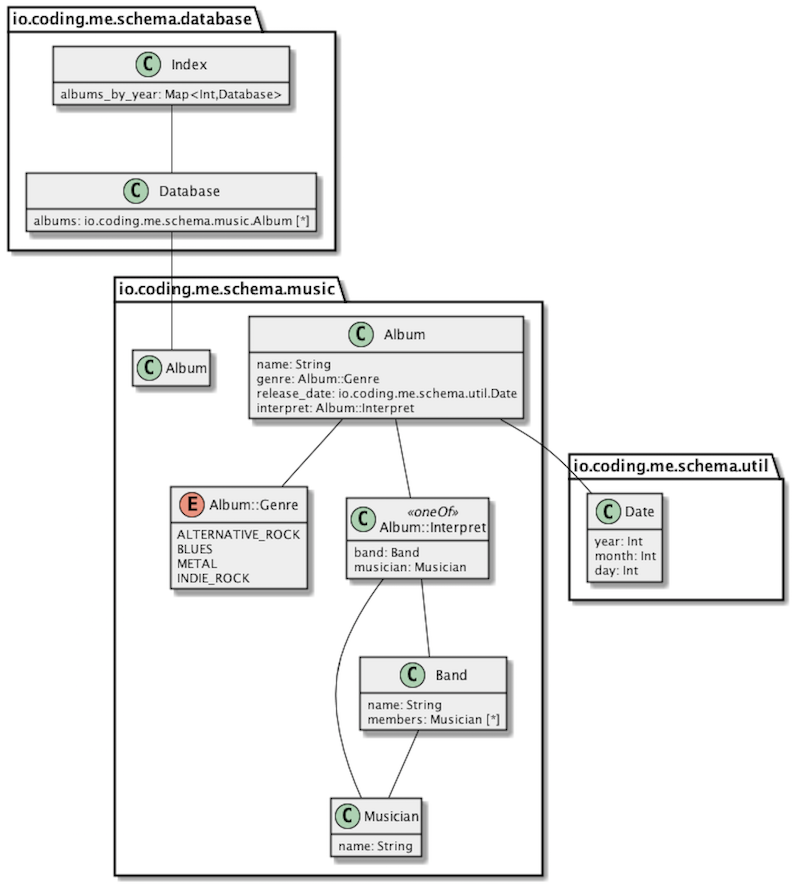

# protoc-gen-uml

[](https://travis-ci.org/tssp/protoc-gen-uml)

[Protocol buffer compiler plugin](https://developers.google.com/protocol-buffers/docs/reference/other) for UML diagrams.

When dealing with protocol buffers in your project, it is often quite difficult to get a proper overview - or better the essence of the data model, especially when you have many types.
I am not an UML evangelist, but at least for data models it seems to be a very valuable tool (though there may be other valuable areas).
Loosely based on "a picture is worth more than a thousand words" I strongly believe a generated class diagram for your proto messages and enums (services are not yet supported) allows you
and your clients a faster understanding of your model.

The basic idea of protoc-gen-uml is to plugin into `protoc` and generate a new representation that can be understood by different UML tools, such as PlantUML.

Of course one could generate - let's say - Java classes with protoc and then again generate a class diagram out of the generated classes.
But at least for me it never felt like having a good reflection of the proto model.

Currently the compiler plugin only supports [PlantUML](http://plantuml.com/) format. Other output formats are planned (e.g. [UMLGraph](http://www.umlgraph.org/) or [DOT](http://graphviz.org/)).



## Usage

```bash

# Checkout latest version from Github
 git clone https://github.com/tssp/protoc-gen-uml .

# Package binaries
cd protoc-gen-uml
sbt universal:stage

# Make binaries available in your current path
export PATH=$(pwd)/target/universal/stage/bin:$PATH

# Compile protos
protoc --uml_out=/tmp -I src/test/resources/sample-protos/complex/ src/test/resources/sample-protos/complex/*.proto

# Creates output file in /tmp/
```

The model file itself is not that useful, but converting it to a graphic finally makes it more readable (ensure to have PlantUML installed):

```bash
plantuml /tmp/complete_model.puml
```

## Versions

The plugin is developed and tested with PB version 3 and requires Scala 2.11 and Java 8. Currently it is not in a state which is releasable - exhaustive tests of more protos are required.

## Type Transformation

### General

In general messages and enumerations get transformed directly to class and enum entities inside UML.
Each scalar field type of a message get transformed to its Java counterpart (for the sake of convenience).
All non-scalar field types become message types.

### Nested Types

Nested types and its field are be treated as descriped above, except their type name.
The name gets prefixed with its enclosing type's name separated by double colon.

### OneOf Types

To properly reflect the idea of oneOf-fields, the get transformed to a separate class with a special stereotype.
The fields that are part of the oneOf-group are moved to the new type.
Type name of the new class is a camel-cased variant of the original field name prefixed with the enclosing type as described above.

### Map Types

Maps are treated as simple field types with two parameters.  Even though protoc creates artificial nested types for maps, they are omitted.

### Multiplicity

TBD

### Polymorphism

TBD

(Proto2 extensions)[https://developers.google.com/protocol-buffers/docs/proto#extensions] will be transformed to normal fields. 

There is not yet a special representation for (any types)[https://developers.google.com/protocol-buffers/docs/proto3#any] planned.
Since the actual type of the content of the field is only known at runtime, it can not be properly represented. Ideas?


## Configuration

The plugin comes with a plenty of configuration options, controlling the output behavior. There is not yet a proper idea of integrating it into the protoc CLI.
Using the default protoc meachanism seems to be too verbose.

The configuration switches can be found in the [application.conf](src/main/resources/application.conf).

## Plans and Roadmap

* Support for rich documentation (diagrams + written words)
* Make model transformer open for user-defined extensions and options
* Switch from internal if/else output formatting to a more powerful template engine


## Related Projects

* [protoc-gen-doc](https://github.com/estan/protoc-gen-doc) is a very good documentation generator for protocol buffers
* [ScalaPB](https://github.com/trueaccord/ScalaPB) is the execellent Scala code generator for protocol buffers
